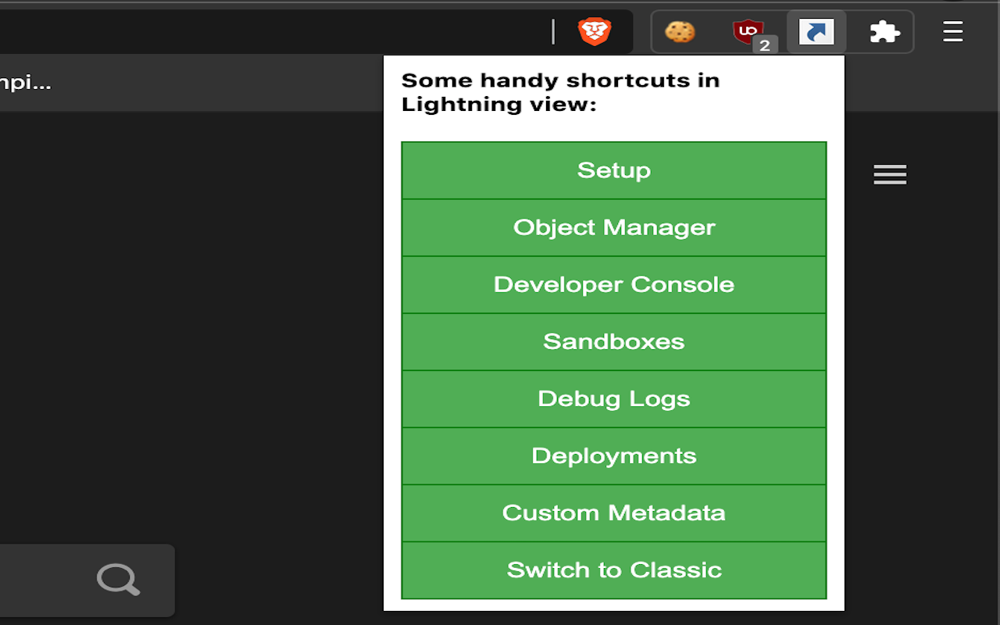

# Chrome Extension for Salesforce Setup Lightning shortcuts

Tired of waiting for the Lightning UI to load before you can navigate to setup/deployments/debug logs etc.?

Install this Chrome extension and you can do that all without being blocked.

Blog post about it here: https://rohitmacherla.com/posts/chrome-extension-for-navigating-lightning-ui

Icon Credit: https://commons.wikimedia.org/wiki/File:Piurl_Logo.png

Screenshot:
